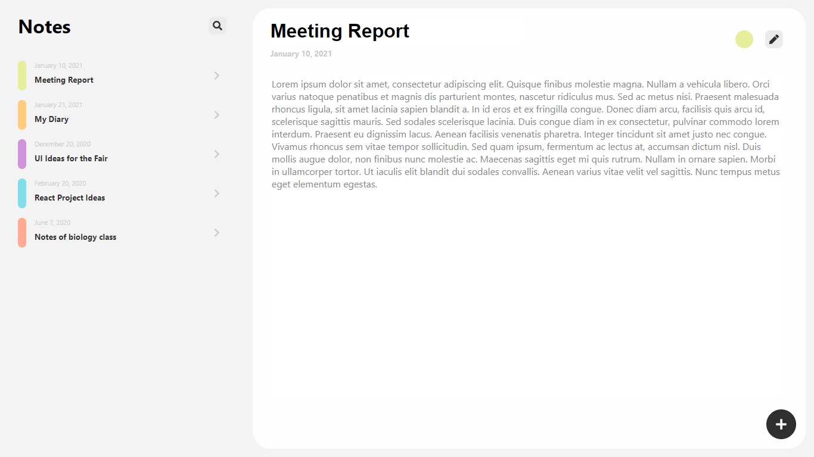

# react-notebook

 > A note taking app in React.js using hooks.

[](https://travis-ci.org/badges/badgerbadgerbadger) [](https://coveralls.io/r/badges/badgerbadgerbadger) [](http://badges.mit-license.org)

This project consists of a SPA where notes are shown and edited. Each note can be created, edited, deleted and customized. All the data in the app is available during execution and is not saved, but feel free to integrate it with an API or a file saver. All notes are stored in an array in the highest state of the app, and to save this data, I recommend you change the CRUD methods in App.js to make them save everything elsewhere.


*Print of the interface.*

## Installation

Download or clone the project and run:

```sh
npm install
npm start
```
The project should open normally in the port 3000.

## Meta

Copyright (c) Eduardo Migueis 2020.

Distributed under the MIT license. See ``LICENSE`` for more information.

[https://github.com/edumigueis/react-notebook](https://github.com/edumigueis)
